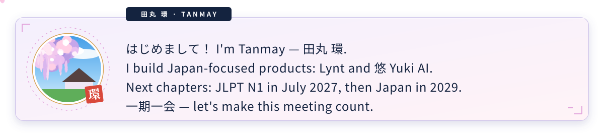
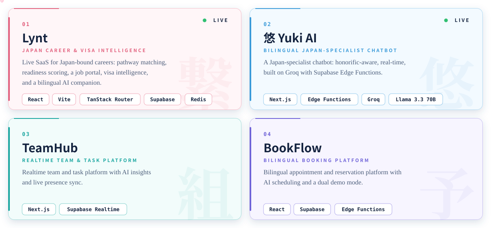
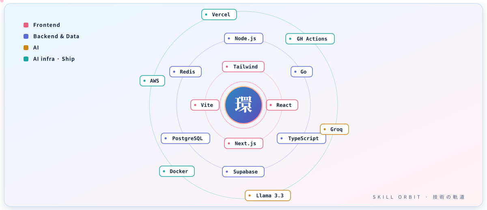
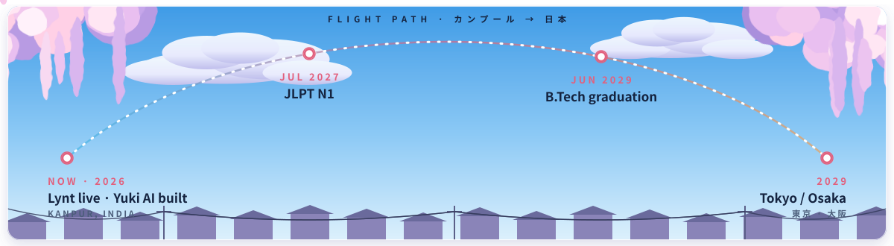
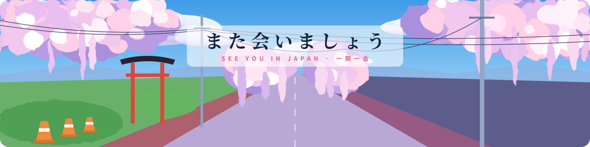

<div align="center">



<a href="https://tanmaytrivedi.dev">
  
</a>

<br/>


[](https://tanmaytrivedi.dev)
[](mailto:tanmay.trivedi.jp@gmail.com)
[](https://www.linkedin.com/in/itanmaytrivedi)





</div>

## ☀️ &nbsp;自己紹介 · About

```text
$ whoami
> Tanmay Trivedi — Full-Stack Developer, Kanpur, India
> B.Tech Biotechnology, Rama University — Class of 2029
> Building bilingual, production-grade software for the Japanese market
> JLPT N1 — in progress
> Target: Bridge Engineer / Full-Stack Developer, shinsotsu 2029
```

I started in biotechnology and ended up building software for Japan. I work solo end to end: design, database, deploy, and the Japanese localization most teams leave for last.

<div align="center"></div>

## 🚉 &nbsp;いまのわたし · Right Now

<div align="center">

</div>

<div align="center"></div>

## 🌸 &nbsp;制作物 · Projects

<div align="center">
<a href="https://tanmaytrivedi.dev">
  
</a>
<br/>
<sub>Full case studies → <a href="https://tanmaytrivedi.dev"><b>tanmaytrivedi.dev</b></a></sub>
</div>

<div align="center"></div>

## 🧬 &nbsp;研究 · Research

I'm lead researcher and first author on a published paper from Rama University, and I built a bioinformatics tool alongside it. Biology gave me the habit of testing what I claim, and I bring that to my engineering.

<div align="center"></div>

## 🎴 &nbsp;資格 · Certifications

<div align="center">

</div>

<details>
<summary><b>📋 &nbsp;As a list</b></summary>

<br/>

- **Foundational C# with Microsoft** — freeCodeCamp
- **AWS S3 Basics**
- **Azure Cognitive Services**
- **MCP Advanced Topics** — Anthropic
- **Elements of AI** — University of Helsinki

</details>

<div align="center"></div>

## 🪐 &nbsp;技術の軌道 · Tech Stack

<div align="center">

</div>

<details>
<summary><b>📋 &nbsp;Full stack, as a list</b></summary>

<br/>

| | |
| :-- | :-- |
| 🎨 **Frontend** | React · Next.js · Vite · TypeScript · Tailwind · shadcn/ui · Framer Motion |
| ⚙️ **Backend & Data** | Node.js · Go · PostgreSQL · MongoDB · Redis · Supabase (Auth, Realtime, Edge Functions) |
| 🧠 **AI** | Groq · Llama 3.3 70B · bilingual, honorific-aware prompt design |
| 🚀 **Ship** | Docker · AWS · Vercel · CI/CD · GitHub Actions |

</details>

<div align="center"></div>

## ✈️ &nbsp;日本への道 · Japan Journey

<div align="center">

</div>

<div align="center"></div>

## 🍡 &nbsp;趣味 · Hobbies Corner

Slice-of-life and romance anime are my comfort genre, with *Jujutsu Kaisen*, *Bleach* and *Demon Slayer* for when I want something louder. I put Japanese culture into my products because I care about it, and that shows up in the details.

<div align="center"></div>

## 💌 &nbsp;連絡先 · Reach Me

<div align="center">

<a href="mailto:tanmay.trivedi.jp@gmail.com"></a>

I'm looking for **product-led Japanese teams** that value craft, bilingual delivery, and shipping over ceremony.

### **design → Postgres → ship → measure → 日本語化**

<a href="mailto:tanmay.trivedi.jp@gmail.com">
  
</a>

<a href="mailto:tanmay.trivedi.jp@gmail.com">
  
</a>

[](mailto:tanmay.trivedi.jp@gmail.com)
[](https://tanmaytrivedi.dev)
[](https://www.linkedin.com/in/itanmaytrivedi)

<br/>

<br/>
<sub><i>「改善は毎日の小さな一歩から。」 Improvement is built one quiet commit at a time.</i></sub>

</div>
